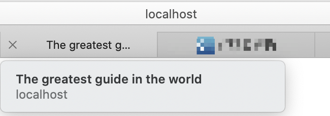
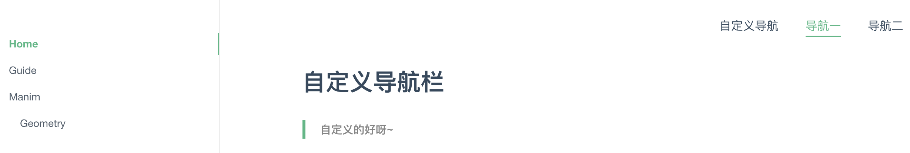
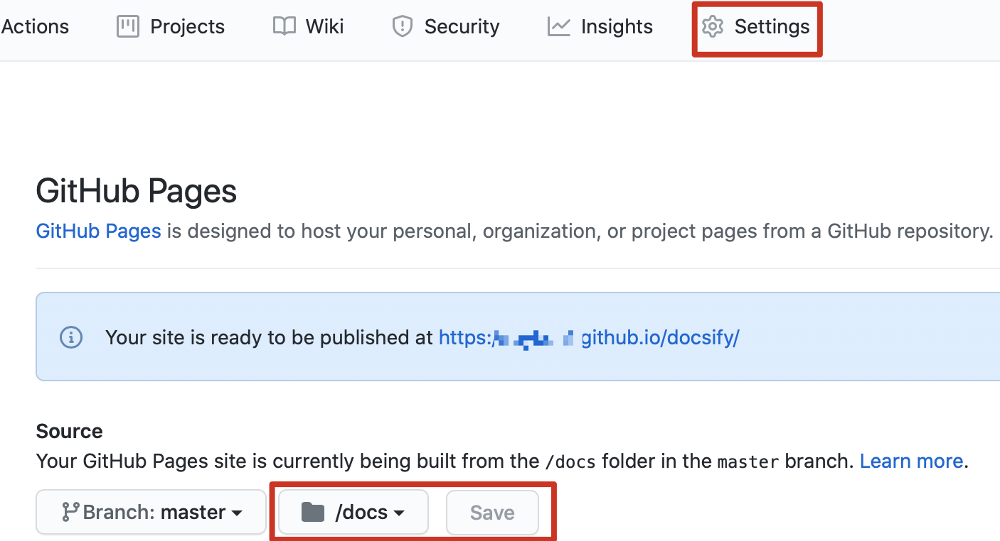

# Docsify

## 使用教程

- 建议全局安装docsify cli，这有助于在本地初始化和预览网站
  - 安装命令：`npm i docsify-cli -g`
  - npm是一款包管理工具，安装方法自度
- 初始化
  - 如果要在./docs子目录中编写文档，可以使用init命令：`docsify init ./docs`
  - 当然，你可以自定义在任何文件夹下
- 写点内容
  - 初始化之后，你可以看到docs文件夹下多了几项内容：
    - `index.html` ：文档网站入口文件
    - `README.md` ：文档首页
    - `.nojekyll` ：防止GitHub页忽略以下划线开头的文件
  - 我们编写内容只需要在README文件中，如果想要其他页面就新建`.md`文件
- 现在可以预览你的文档网站了
  - 使用命令：`docsify serve docs`，会出现提示：`http://localhost:3000`，在浏览器中输入此地址
  - 如果你不想使用`npm`让你的网站运行起来，可以手动创建`index`文件，并使用Python启动服务，[参考](https://docsify.js.org/#/quickstart?id=quick-start)

## 搞点花样

## 一个二级标题<!-- {docsify-ignore} -->

> 等待加载

- 在`index.html`文件中修改
  - 添加`<div id="app">Please wait......</div>`，可以出现在页面渲染之前，提示用户稍后

> 侧边导航栏

- 默认情况下，会根据当前页面的标题生成导航，可以定制

- 修改`index.html`文件

  ```js
  <script>
    window.$docsify = {
      loadSidebar: true
    }
  </script>
  <script src="//cdn.jsdelivr.net/npm/docsify/lib/docsify.min.js"></script>
  ```

- 新建`docs/_sidebar.md`文件，名称固定

  ```tex
  * [Home](/)
  * [Guide](Guide/guide.md)
  * [Manim](Manim/install.md)
  ```

  - 此时你的侧边栏就会出现Home、Guide和Manim三个导航
  
- 规则：会先找到此配置文件进行sidebar配置，如果没有就使用`window.$docsify`中开启的配置

  - 如果一个子目录中有`_sidebar.md`文件，那么这个子目录下的所有页面将使用这个文件的侧边栏
  - 如果在任何页面你都想使用根目录的导航栏，可以设置`alias`字段：
  
  ```js
  <script>
    window.$docsify = {
      loadSidebar: true,
      alias: {
        '/.*/_sidebar.md': '/_sidebar.md'
      }
    }
  </script>
  ```
  
  - 根目录中的层级关系如何体现呢？
  
  ```md
  * [Home](/)
  * [Guide](Guide/guide.md)
  * [Manim](Manim/)
    * [Geometry](Manim/Geometry/geometry.md)
  ```
  
  - 同样的，你可以在子目录下创建`README.md`文件作为初始页面，在路由文件中配置`/`即可
  
- 以上便是docsify的目录（或者说路由）管理

> 页面标题

- 在路由配置文件中添加注释文字，即可作为页面标题

  ```md
  * [Home](/)
  * [Guide](Guide/guide.md "The greatest guide in the world")
  ```

  

> 当前页面目录

- 侧边栏还可以设置显示当前页面的目录（标题）

  - 在 `window.$docsify` 添加 `subMaxLevel` 字段

  | 值   | 说明                                           |
  | ---- | ---------------------------------------------- |
  | 0    | 默认值，表示不显示页面目录                     |
  | 1    | 显示一级标题(`h1`)                             |
  | 2    | 显示一、二级标题(`h1` ~ `h2`)                  |
  | 3    | 显示一、二、三级标题(`h1` ~ `h3`)              |
  | n    | n是数字，显示一、二、....n 级标题(`h1` ~ `hn`) |

  - 和根目录的层级显示并不冲突，如果你想让页面的某些标题不显示，可以加`<!-- {docsify-ignore} -->`

  ```
  ## 一个二级标题 <!-- {docsify-ignore} -->
  ```

  - 如果想让当前页的所有标题不显示，在首标题后添加 `<!-- {docsify-ignore-all} -->` 即可

## 自定义导航

> HTML方式

- 上面说了各页面的路由管理，但规则还是比较苛刻，如果想自定义路由，可以在`index.html`文件中添加链接

  ```html
  <body>
    <nav>
      <a href="#/">自定义导航</a>
      <a href="#/CustomNav/">导航一</a>
      <a href="#/CustomNav/subCN/">导航二</a>
    </nav>
  </body>
  ```

- 右上角就会出现我们自定义的导航链接

  

> 配置文件方式

- 类似侧边栏，还可以通过根目录创建 `_navbar.md` 文件自定义导航栏

  - 在`window.$docsify`中添加 `loadNavbar: true`
  - 在配置文件中添加，下级导航会变成下拉列表的形式

  ```md
  * [En](/en)
    * [home1](home1)
    * [home2](home2)
  * [Chinese](/zh-cn/)
    * [长江]()
    * [黄河]()
  ```

  - 规则：配置文件的优先级高于HTML中的定义

- 导航中使用表情

  ```md
  * [:us:, :uk:](/)
  * [:cn:](/zh-cn/)
  ```

  

## 设置封面

- 在 `window.$docsify` 添加`coverpage: true `选项，根目录创建 `_coverpage.md`文件

  ```md
  
  # Manim文档网站
  ## 个人文档网站
  > 一个神奇的文档图像制作工具
  
  * Simple and lightweight (~12kb gzipped)
  * Multiple themes
  * Not build static html files
  
  [GitHub](https://github.com/docsifyjs/docsify/)
  [Get Started](/README)
  [Get Started](/README)
  ```

- 只会在根目录下加载封面：默认封面和首页一起显示，一上一下

  

- 可以让docsify网站首页只显示封面，在 `window.$docsify`添加 `onlyCover: true`

  - 注意修改去往首页的链接！默认将 `/` 配到封面，首页（即`Get Started`）配置到README.md文件

- 如果你的文档需要配置多个封面

  - 例如Manim下需要新的封面，在`window.$docsify` 配置 `coverpage: ['/', '/Manim/']`
  - 自然，也需要在其下创建 `_coverpage.md`文件
  - 注意**图片不能太大**，`Get Started`路由也需要配置，总跳到封面不好~

## 部署到GitHub

- 你有GitHub账号吗？邮箱注册一个，新建仓库得到地址

- 在电脑终端，切换到你的文档目录下

  - 例如我在docsify安装目录下新建docsify_test，其下新建`docs`目录存放整个项目，那我就切换到docsify_test

  ```shel
  git init
  git add .
  git commit - "学习使用docsify部署文档网站"
  git remote add origin 新建仓库的地址
  git push --set-upstream origin master
  ```

  - 推送到master分支，第一次可能需要输入邮箱密码
  - 然后，在settings中设置此仓库的首页为你刚上传的`/docs`文件夹

  

  - 看到打码的那行字没？这就是你的文档网站的地址了！访问之~

- 如果更新了哪个文件，就进入目录`git add .`、`git commit -m`、`git push`

  - 文件上传到GitHub并更新需要一些时间，三五分钟！
  
- 如果你建立了新的仓库想部署新的文档，这个文档需要和上面提到的`docsify_test`同级目录，然后将你的站点根目录以`docs`命名放进去（只能是docs），然后在里面`git init...`，如果操作失误可以在本地将仓库清空（或者直接删除重建），将本地的`.git`文件删除，重新初始化

  - 总而言之，用目录将仓库隔开维护

## 全局搜索

- 全局搜索需要用到插件，它会根据当前页面上的超链接获取文档内容，然后建立索引存储在本地（localStorage）

  ```js
  window.$docsify = {
    // 完整配置参数
    search: {
      maxAge: 86400000,               // 过期时间，单位毫秒，默认一天
      paths: [],                      // or 'auto'，匹配文件路径
      placeholder: 'Type to search',  // 搜索提示框文字， 支持本地化，不同页面可以设置不同提示
      // placeholder: {
      //   '/Manim/': '搜索',
      //   '/': 'Type to search'
      // },
      noData: 'No Results!',          // 找不到结果文字提示，支持本地化，例子在下面
      // noData: {
      //   '/Manim/': '找不到结果',
      //   '/': 'No Results'
      // },
      depth: 2,                       // 搜索标题的最大程级, 1 - 6
    }
  }
  <script src="//unpkg.com/docsify/lib/plugins/search.js"></script>
  ```

- 关键是引入这个插件，懂了没有？

## 评论

- 非官方文档必须可以吐槽，才能进步！这里使用Gitalk评论插件，使用方法如下：

  - 直接在HTML中引入就好了，安装也行，自己查吧

    ```html
    <link rel="stylesheet" href="//unpkg.com/gitalk/dist/gitalk.css">
    <script src="https://cdn.bootcss.com/blueimp-md5/2.10.0/js/md5.js"></script>
    ```

  - 添加评论区域

    ```html
    <div id="gitalk-container"></div>
    ```

  - 配置GitHub

    ```html
    <script src="//unpkg.com/docsify/lib/plugins/gitalk.min.js"></script>
    <script src="//unpkg.com/gitalk/dist/gitalk.min.js"></script>
    <script>
      const gitalk = new Gitalk({
        clientID: 'Github Application Client ID',
        clientSecret: 'Github Application Client Secret',
        repo: 'Github repo',
        owner: 'Github repo owner',
        admin: ['Github repo collaborators, only these guys can initialize github issues'],
        // facebook-like distraction free mode
        distractionFreeMode: false
      })
    </script>
    ```

- `clientID`需要在你的GitHub——setting——Developer settings——OAuth Apps创建

  - URL就是你的GitHub Page主页，或者先写成本地端口调试

  - 如果配置正确下方会出现如下提示

    

  - 此时就可以去授权Application的地方改成你的GitHub文档主页地址，然后在这里登录你（站主）的GitHub账号，就会自动在docsify仓库下出现`Issues`，这就算初始化了啦！也可以是上面配置`admin`中的其他账号登录~

  - 评论需要登录GitHub账号哦~

- 更多插件使用方法查看[官网](https://docsify.js.org/#/plugins)

- 增加复制代码插件，引入即可

  ```html
  <script src="//cdn.jsdelivr.net/npm/docsify-copy-code"></script>
  ```

- 增加缩放图片的插件，引入即可

  ```html
  <script src="//cdn.jsdelivr.net/npm/docsify/lib/plugins/zoom-image.min.js"></script>
  ```

  - 如果不想被缩放，需要在图片引入时加入：``

- 增加分页插件，引入即可

  ```html
  <script src="//cdn.jsdelivr.net/npm/docsify/lib/docsify.min.js"></script>
  <script src="//cdn.jsdelivr.net/npm/docsify-pagination/dist/docsify-pagination.min.js"></script>
  ```

- 增加样式插件，引入即可

  ```html
  <link rel="stylesheet" href="https://cdn.jsdelivr.net/npm/docsify-themeable@0/dist/css/theme-simple.css">
  ```

  - 这个图片缩放和样式什么玩意儿？有BUG，可能是排版不规范？


